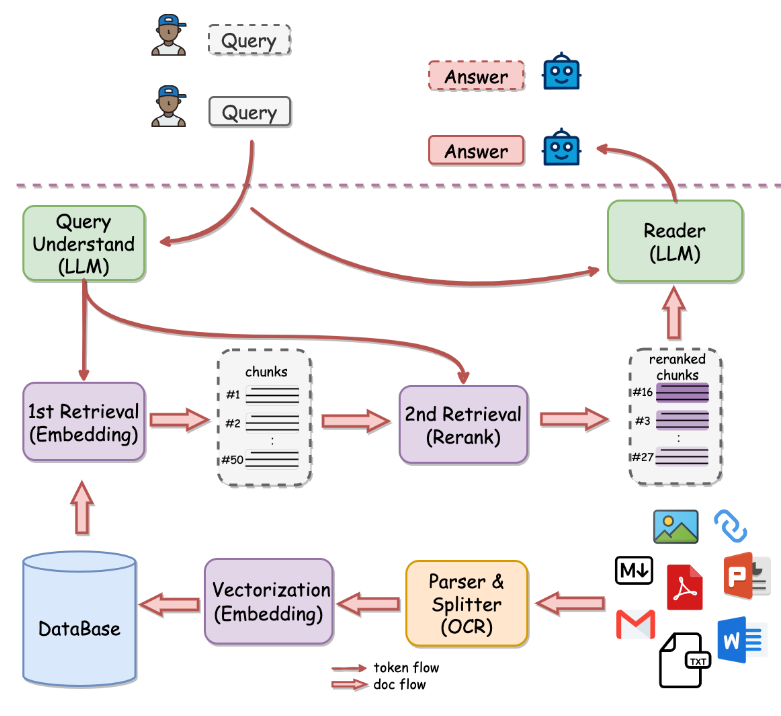

# TinyRAG

A tiny RAG system.

- [TinyRAG](#tinyrag)
  - [设计](#设计)
  - [模块](#模块)
  - [项目结构](#项目结构)
  - [QuickStart](#quickstart)


项目参考 [QAnything](https://github.com/netease-youdao/qanything) 的设计并在 [KMnO4-zx/TinyRAG](https://github.com/KMnO4-zx/TinyRAG) 项目的基础之上进行了二次开发，增加了以下功能：

- 增加Faiss向量数据库支持
- 增加基于Gradio的web支持

并对部分功能进行删减：

- Embedding模块只支持BGEEmbedding和ZHIPU API方式的embedding
- 模型模块只支持ZHIPU的glm-4-plus模型的对话

## 设计



## 模块

- 文档加载和切分模块：用来加载文档并切分成文档片段，支持pdf文件
- 向量化模块：用来将切分后的文档片段向量化，使用bge模型
- 数据库：存放文档片段和对应的向量，使用faiss向量数据库
- 检索（召回）模块：实现单路召回用来根据 Query （问题）检索相关的文档片段，在faiss数据库中召回top-n
- 重排模块：使用检索（召回）模块的结果，使用bge重排模型进行重排
- 模型模块：用来根据检索出来的文档和用户的输入，回答用户的问题

## 项目结构

- loader.py
  - ReadFiles：用于读取并分割pdf文件，采用固定长度分割文本块的方式
- embedding.py
  - BaseEmeddings
  - BgeEmbedding：使用BGE模型，获取字符串对应的embedding向量
  - ZhipuEmbedding：通过zhipu api获取字符串对应的embedding向量
- vector_store.py
  - VectorStore：采用本地json存储分割后的文档以及embedding的方式
  - FaissVectorStore：使用Faiss数据库存储embedding的方式
- reranker.py
  - BgeReranker：使用BEG ReRanker模型对召回的结果进行重排
- model.py
  - ZhipuChat：支持使用zhipu glm-4-plus模型进行对话
- local_demo.py
  - 作为基于json和基于faiss数据库对话的测试文件
- web_demo.py
  - 使用Gradio可视化

## QuickStart

安装依赖包

```shell
pip install -r requirements.txt
```

设置ZHIPU API KEY（需要去 [zhipu bigmodel](https://open.bigmodel.cn/usercenter/apikeys) 申请）

```shell
export ZHIPUAI_API_KEY=xxxxxxxxx
```

启动web

```shell
python3 web_demo.py
```

浏览器访问：

```shell
http://localhost:9001/
```
