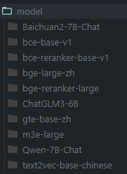

# TinyRAG

A tiny RAG system.

- [TinyRAG](#tinyrag)
  - [设计](#设计)
  - [模块](#模块)
    - [文件解析](#文件解析)
    - [召回](#召回)
    - [精排](#精排)
    - [推理](#推理)
  - [QuickStart](#quickstart)
    - [模型准备](#模型准备)
    - [Offline](#offline)
    - [Online](#online)
  - [TODO](#todo)


项目参考 [QAnything](https://github.com/netease-youdao/qanything) 和 [KMnO4-zx/TinyRAG](https://github.com/KMnO4-zx/TinyRAG) 项目的设计，完成了一个基于vLLM的PDF文档检索问答RAG，项目的主要特性：

- 增加PDF分句、分块和滑动窗口的支持
- 增加Faiss多路向量召回和BM25和TFIDF召回的支持
- 增加基于BGE、BCE模型的重排支持
- 增加vLLM推理的支持
- 增加基于Gradio的web支持

数据来自于：[2023全球智能汽车AI挑战赛——赛道一：AI大模型检索问答](https://tianchi.aliyun.com/competition/entrance/532154)

## 设计


## 模块

### 文件解析

目前只支持 PDF 文件解析

提供了三种不同的方式，最终采用三种方式的组合来保证解析内容的完整性、准确性和连续性

- 分块
  - 按照文字的字体级别进行分块解析，保证内容级别上的完整性
- 单句
  - 按照句子级别进行解析，使用简单的句号分割，获取最小粒度的文本内容
- 滑窗
  - 按照句子级别进行解析，根据固定的窗口大小，进行句子级别的滑动，保证内容的连续性，尤其针对上下文连续内容被分页干扰的情况

### 召回

基于 langchain 的 retrievers 进行召回的实现，支持了 BM25、TFIDF 的字面检索和 M3E、BGE、GET、BCE 的语义检索。

实现了多路检索，支持多路召回的结果融合。

### 精排

分别实现了基于 BGE 和 BCE 的重排，支持了多路召回的结果重排。

### 推理

提供统一接口实现了基于 vLLM 的 ChatGLM、Qwen2 和 Baichuan2 的推理。

引入了推理相关的一些 trick：

- 问题扩写，和原问题拼接
- 问题直接生成答案后，将和扩写拼接后的融合问题再进行融合，之后召回
- 将多路召回的内容，使用大模型进行融合润色
- 将推理获得的结果和原始问题、内容组合在一起后，进行二次的答案优化

## QuickStart

### 模型准备



### Offline

离线推理：

```shell
python3 run_offline.py
```

### Online

配置 huggingface 镜像代理

```shell
export HF_ENDPOINT=https://hf-mirror.com
```

安装依赖包

```shell
pip install -r requirements.txt
```

如果使用 spacy，需要执行命令来下载

```shell
python3 -m spacy download zh_core_web_sm
```

设置ZHIPU API KEY（需要去 [zhipu bigmodel](https://open.bigmodel.cn/usercenter/apikeys) 申请）

```shell
export ZHIPUAI_API_KEY=xxxxxxxxx
```

启动web

```shell
python3 run_online.py
```

浏览器访问：

```shell
http://localhost:9001/
```

## TODO

  
- 不同模型的统一多轮对话
  - 直接将之前的对话结果传入模型会造成冗余，不精确
  - 不同的策略适用于不同的场景
    - 使用模型对历史会话做总结
      - 历史所有对话做整体总结
      - 长短时记忆：滑动窗口 + 时间衰减方式，对较早的对话做总结，较新的对话保留原文
      - 总结用户问题和模型的回答结果作为一条信息
      - summary的模型通常比较小，需要根据模型情况设计history的窗口大小，保证输出质量
    - 构建历史对话向量数据库
      - 1.可以把相近问题的答案直接抛出来
      - 2.提取关键的历史信息
    - 滑动窗口方式
    - 关键词提取
      - 实体提取：NER提取历史对话中的实体信息
      - 流程：新query来了之后，先查上文的几条历史信息的关键词，将提取出来的关键词和当前的query组合起来进行语义改写，用改写后的query来查询
    - 人为对query做意图理解
- 结果评估
  - 人工


长短时记忆：

Naive方式：

histoy = [
  {"role":sys, content: ""},
  {"role":user, content: ""},
  {"role":sys, content: ""},
  {"role":user, content: ""},
]

current_query = {"role":user, content: ""},

长短记忆方式：

histoy = [
  {"role":sys, content: "用户问了XXX，模型回答是XXX"},
  current_query = {"role":user, content: ""},
]
